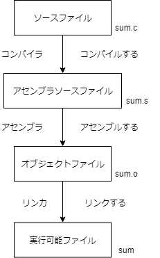
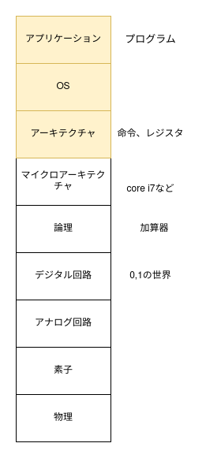
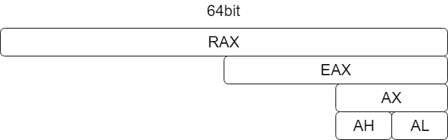
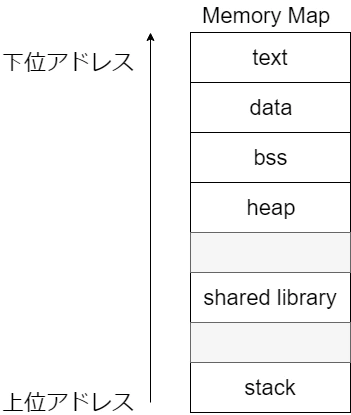

# アセンブリを読む

- この章では、Cで書かれた簡単なプログラムが実行される過程を通して、低レイヤの様々な概念を学びます。

## 低レイヤとは

- まずはこれから学ぶ範囲のイメージを持ってもらおうと思います。
- 低レイヤとはどのレイヤを指すのでしょうか？はじめに、ソースコードが実行されるまでという観点から見てみます。



- この図で私たちがこれから学ぶのはアセンブラソースファイルと実行可能ファイルのところです。
- では、OSやアプリケーションといった広い枠組みで観るとどうでしょうか。(「ディジタル回路設計とコンピュータ・アーキテクチャ」より、一部変更した図を引用しています。)



- 私たちがこれから学ぶのは黄色の部分なので、あまり低くない感じがしますね。
- 「ソフトウェアレイヤから見ると」低レイヤを学んでいくんだな、ということがわかれば大丈夫です。

## 簡単なプログラムが実行されるまでを見ていく

- Hello World相当のプログラムを理解していきましょう。
- 以下のC言語で書かれたファイルを実行してみます。

```c
#include <stdio.h>
int main(void) {
    int a = 1;
    int b = 10;
    printf("sum is %d\n", a+b);
    return 0;
}
```

- command

```
$ gcc main.c
$ ./a.out
# sum is 11 と表示される
```

- 以下の図のように、実行ファイル(ここでのa.out)が作られるまでにはいくつかの工程があります。ここではC言語に限らず一般的な仕組みを説明します。


- C(gcc)で中間表現に当たるところはマクロを展開したあとなどが入るかもしれないですが、今回はそこは扱わないのでアセンブリを見ていきましょう。
- アセンブリを出力してみます。出力の仕方は2つあって、ひとつはソースコードからアセンブリを出力する方法、もうひとつは実行可能ファイルからアセンブリを復元する(ディスアセンブルといいます)方法です。
- どちらもやってみましょう。
- まずはソースコードからアセンブリを出力します。

```bash
$ gcc -S main.c
```

- `main.s`というファイルができたと思います。

```
	.file	"main.c"
	.text
	.section	.rodata
.LC0:
	.string	"sum is %d\n"
	.text
	.globl	main
	.type	main, @function
main:
.LFB0:
	.cfi_startproc
	endbr64
	pushq	%rbp
	.cfi_def_cfa_offset 16
	.cfi_offset 6, -16
	movq	%rsp, %rbp
	.cfi_def_cfa_register 6
	subq	$16, %rsp
	movl	$1, -8(%rbp)
	movl	$10, -4(%rbp)
	movl	-8(%rbp), %edx
	movl	-4(%rbp), %eax
	addl	%edx, %eax
	movl	%eax, %esi
	leaq	.LC0(%rip), %rdi
	movl	$0, %eax
	call	printf@PLT
	movl	$0, %eax
	leave
	.cfi_def_cfa 7, 8
	ret
	.cfi_endproc
.LFE0:
	.size	main, .-main
	.ident	"GCC: (Ubuntu 9.3.0-17ubuntu1~20.04) 9.3.0"
	.section	.note.GNU-stack,"",@progbits
	.section	.note.gnu.property,"a"
	.align 8
	.long	 1f - 0f
	.long	 4f - 1f
	.long	 5
0:
	.string	 "GNU"
1:
	.align 8
	.long	 0xc0000002
	.long	 3f - 2f
2:
	.long	 0x3
3:
	.align 8
4:

```

- 次にディスアセンブルしてみます。
- `objdump` コマンドの結果をみてみます

```
objdump -d -Mintel a.out > disas.txt
```

- `disas.txt`は以下のようになります。(一部を表示しています)

```
0000000000001149 <main>:
    1149:	f3 0f 1e fa          	endbr64 
    114d:	55                   	push   rbp
    114e:	48 89 e5             	mov    rbp,rsp
    1151:	48 83 ec 10          	sub    rsp,0x10
    1155:	c7 45 f8 01 00 00 00 	mov    DWORD PTR [rbp-0x8],0x1
    115c:	c7 45 fc 0a 00 00 00 	mov    DWORD PTR [rbp-0x4],0xa
    1163:	8b 55 f8             	mov    edx,DWORD PTR [rbp-0x8]
    1166:	8b 45 fc             	mov    eax,DWORD PTR [rbp-0x4]
    1169:	01 d0                	add    eax,edx
    116b:	89 c6                	mov    esi,eax
    116d:	48 8d 3d 90 0e 00 00 	lea    rdi,[rip+0xe90]        # 2004 <_IO_stdin_used+0x4>
    1174:	b8 00 00 00 00       	mov    eax,0x0
    1179:	e8 d2 fe ff ff       	call   1050 <printf@plt>
    117e:	b8 00 00 00 00       	mov    eax,0x0
    1183:	c9                   	leave  
    1184:	c3                   	ret    
    1185:	66 2e 0f 1f 84 00 00 	nop    WORD PTR cs:[rax+rax*1+0x0]
    118c:	00 00 00 
    118f:	90                   	nop
```

- 見比べてみると、同じものを見ているはずなのに違うことに気づくでしょうか。
  - AT&T記法とintel記法の違い
- 今回はintel記法で、かつ `.cfi_` のようなデバッグ情報を消していきたいので以下のコマンドで行います
- `-fno-asynchronous-unwind-tables` でデバッグ情報を消し、 `-masm=intel` でintel記法にしています。

```
$ gcc -fno-asynchronous-unwind-tables -masm=intel -S main.c -o main.s
```

- これでようやく今回見ていくアセンブリができました。

```
	.file	"main.c"
	.intel_syntax noprefix
	.text
	.section	.rodata
.LC0:
	.string	"sum is %d\n"
	.text
	.globl	main
	.type	main, @function
main:
	endbr64
	push	rbp
	mov	rbp, rsp
	sub	rsp, 16
	mov	DWORD PTR -8[rbp], 1
	mov	DWORD PTR -4[rbp], 10
	mov	edx, DWORD .LC0:PTR -8[rbp]
	mov	eax, DWORD PTR -4[rbp]
	add	eax, edx
	mov	esi, eax
	lea	rdi, .LC0[rip]
	mov	eax, 0
	call	printf@PLT
	mov	eax, 0
	leave
	ret
	.size	main, .-main
	.ident	"GCC: (Ubuntu 9.3.0-17ubuntu1~20.04) 9.3.0"
	.section	.note.GNU-stack,"",@progbits
	.section	.note.gnu.property,"a"
	.align 8
	.long	 1f - 0f
	.long	 4f - 1f
	.long	 5
0:
	.string	 "GNU"
1:
	.align 8
	.long	 0xc0000002
	.long	 3f - 2f
2:
	.long	 0x3
3:
	.align 8
4:

```

- デバッグ用のdirectiveが消えてきれいに見えるようになります。(directiveとは、GNU assemblerに対する命令で、機械語にするときに使われて、CPUアーキテクチャとは関係がありません。 https://sourceware.org/binutils/docs/as/Pseudo-Ops.html#Pseudo-Ops で調べることができます。)
- いろいろみえますが、ディレクティブを無視します。
- 命令は以下の要素から成立しています
  - `<Mnemonic> <destination>, <source>`
- 今回は以下の命令が分かればよさそうです。
  - endbr64
  - mov, lea
  - add, sub
  - push, pop
  - leave, ret
  - call
- これら命令を調べるには、intel SDM vol.2を使って索引から探すのですが、今回は hikalium さんという方が作っている https://hikalium.github.io/opv86/ を使ってみましょう。
- ただし、これらの命令を理解するには事前知識として3つほど必要です。これらを説明していきます。
  - レジスタの説明
  - メモリレイアウト、スタックの説明
  - ABIの説明

## 事前知識

### レジスタ



- レジスタは最初につく文字がRかEかで64bitか32bitかが変わります。
- x86_64-abi仕様書に書いてあるので、見てみましょう https://refspecs.linuxfoundation.org/elf/x86_64-abi-0.95.pdf p.21
- ここでは、rax, rbx, rcx, rdx, rip, rbp, rspを使います。

### メモリレイアウト、スタック



- メモリはこのようになっていて、text領域から1命令ずつ読み出してCPUで実行します。
- ここでは、textとstackを使います。

### ABI

- ABIはApplication Binary Interfaceの略で、関数の引数がレジスタから渡されるときに、どのように渡すかなどを決めている規約。
- x86_64-abi仕様書に書いてあるので、見てみましょう https://refspecs.linuxfoundation.org/elf/x86_64-abi-0.95.pdf p.21

## 読んでみる
- 以上で必要なものは準備できたので、読んでみましょう！

## その他
- PIE/no PIE
- アセンブリはアーキテクチャごとに命令セットが決められていてそこから決定されるので、x86_64以外にもアセンブリは存在する
  - dataの読み込みと保存、四則演算は一般的にどの種類のアセンブリにもある

- 全体を通してもう一度見てみる
