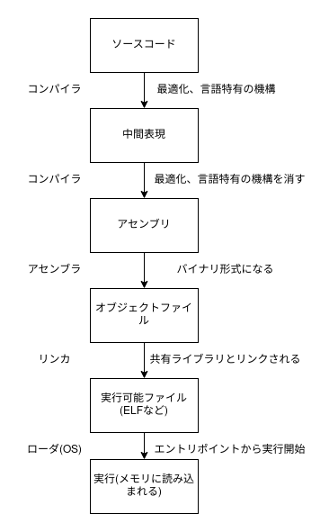
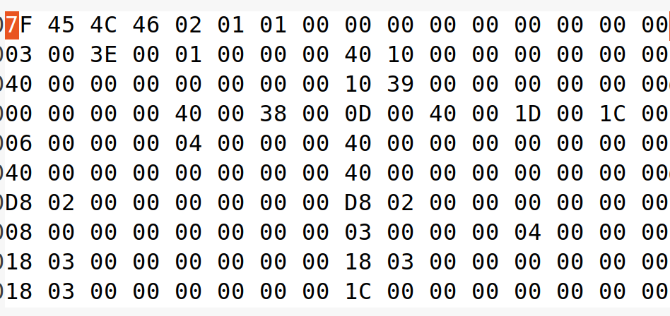

# ELFを読む

- この章では、仕様書と照らし合わせてELFを読んでいくことで、バイナリを読む(パースする)というのは「バイト列を切って見ていくだけ」でそんなに難しいことではないなということを体感してもらえたらOKです。

## ELFについて



- 上の図でアセンブリのところまでをやりました。その下の、オブジェクトファイル、実行可能ファイルがELFにあたります。
- ELFファイルかどうかは `file` コマンドで調べることができます。
- fileコマンドを打つと、以下のように表示されます

```
$ file a.out 
a.out: ELF 64-bit LSB shared object, x86-64, version 1 (SYSV), dynamically linked, interpreter /lib64/ld-linux-x86-64.so.2, BuildID[sha1]=0c3abc6e723c194f04a4efd55b6b6cbe3e53c421, for GNU/Linux 3.2.0, not stripped
```

- `ELF`と書いてありますね。
- 今まではすべてgccがコンパイル、アセンブル、リンクを行ってくれていました。ここでは、途中で生成されるオブジェクトファイルなどを見ていこうと思います。

## オブジェクトファイルと実行可能ファイル

- アセンブリと違って、これはバイナリファイルなので少しとっつきにくいかもしれません。しかし、仕様書を読んでフォーマットの構造を理解すれば、単にバイト列を区切っていくだけなので簡単に感じると思います。
- まずはオブジェクトファイルと実行可能ファイルを用意しましょう。
- 以下のファイルを使って、下のコマンドでオブジェクトファイルと実行可能ファイルを生成します。

```c
int main(void){return 0;}
```

- command

```bash
$ gcc -c main.c -o obj.o # -c optionでオブジェクトファイル生成
$ gcc obj.o -o main # オブジェクトファイルをgccに渡すと実行可能ファイルを生成
```

- これで `obj.o` `main` が得られたと思います。それぞれにfileコマンドをかけてみましょう。

```bash
$ file obj.o
$ file main
```

- 違う表示が現れたことに気づいたでしょうか？おそらく、relocatableとかdynamically linkedみたいな文字を見かけたと思います。これらがなにか調べるために、仕様書を読んでみましょう。
- 仕様書はこちらになります https://refspecs.linuxfoundation.org/elf/gabi4+/contents.html
- Introductionに書いてあるように、relocatable fileは他のオブジェクトファイルとリンクして実行ファイルやshared object fileを生成するためのものだとわかります。
- 仕様書を用意して準備が整ったので、実際にバイナリを見ていきます。



- これは `main` バイナリをghexで見た様子です。
- 全部を解読するのはたいへんなので、ヘッダーのみ読んでいきましょう。

## その他

```
header解説(目で一つ一つ確認していく)
linkとsection, Execとsegment
  readelfでobject, execの違いを見てみる
仕様書からOBJとEXECの違いを見て、headerを見て、読む。
ELF book3 2-13にGOTとPLTについて
https://refspecs.linuxfoundation.org/ から探す
https://qiita.com/amama/items/1fa80c5156729f6f4ea9#%E5%85%A8%E4%BD%93%E5%83%8F ELF直打ち
```
